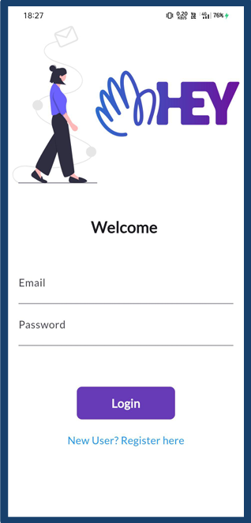
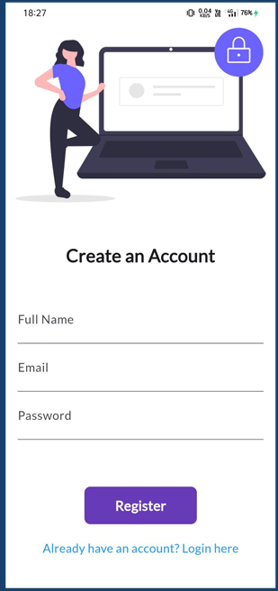
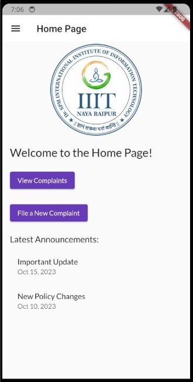
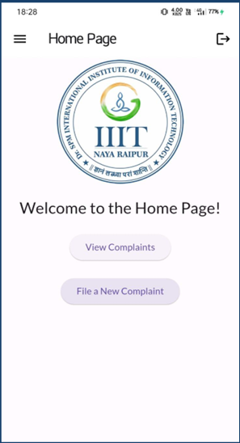
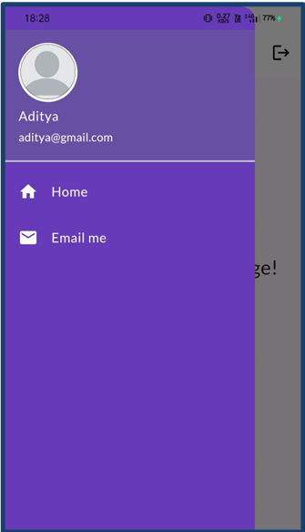
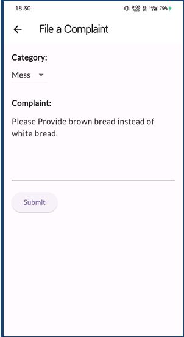
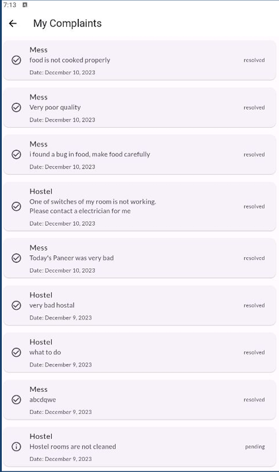

# 🏫 Institute Unified Complaint System

A comprehensive Flutter-based mobile application designed to streamline complaint management for educational institutions. This system provides a unified platform for students to file complaints and administrators to manage them efficiently.

## 📱 Features

### 🔐 Authentication System

- **User Registration & Login**: Secure email/password authentication using Firebase Auth
- **Role-based Access Control**: Separate interfaces for students and administrators
- **Anonymous Sign-in Support**: Optional anonymous access for quick complaints
- **Automatic Role Detection**: Smart routing based on user roles (admin/user)

### 👨‍🎓 Student Features

- **File New Complaints**: Submit complaints with categorization (Mess, Hostel, etc.)
- **View Personal Complaints**: Track status and history of submitted complaints
- **Real-time Status Updates**: Live updates on complaint resolution progress
- **User-friendly Interface**: Intuitive design with easy navigation
- **Complaint Categories**: Organized complaint types for better management

### 👨‍💼 Administrator Features

- **Comprehensive Dashboard**: Overview of all complaints across categories
- **Complaint Management**: View, assign, and resolve complaints
- **User Management**: Access to user information and complaint history
- **Status Updates**: Mark complaints as pending, in-progress, or resolved
- **Category-wise Filtering**: Efficient complaint organization and management

### 🔄 Real-time Functionality

- **Firebase Realtime Database**: Instant data synchronization
- **Live Status Updates**: Real-time complaint status changes
- **Push Notifications**: Updates on complaint progress (extensible)
- **Offline Support**: Basic offline functionality with Firebase caching

## 🛠️ Technology Stack

### Frontend

- **Flutter**: Cross-platform mobile development framework
- **Dart**: Programming language for Flutter development
- **Material Design**: Google's design system for consistent UI/UX

### Backend & Services

- **Firebase Core**: Foundation Firebase SDK
- **Firebase Authentication**: User authentication and authorization
- **Firebase Realtime Database**: Real-time data storage and synchronization
- **Cloud Firestore**: Document-based NoSQL database (if implemented)

### Additional Packages

- **Provider**: State management solution
- **Google Fonts**: Custom typography and fonts
- **URL Launcher**: External link handling
- **Intl**: Internationalization and date formatting
- **Flutter Launcher Icons**: Custom app icons

## 📋 Prerequisites

Before running this project, ensure you have:

### Development Environment

- **Flutter SDK**: Version 3.1.1 or higher
- **Dart SDK**: Compatible with Flutter version
- **Android Studio**: For Android development and emulation
- **VS Code** (recommended): With Flutter and Dart extensions
- **Git**: For version control

### Platform Requirements

- **Android**: API level 21 (Android 5.0) or higher
- **iOS**: iOS 11.0 or higher
- **Web**: Modern browsers (Chrome, Firefox, Safari, Edge)
- **Desktop**: Windows 10+, macOS 10.14+, Linux

### Firebase Setup

- Firebase project with the following services enabled:
  - Authentication (Email/Password provider)
  - Realtime Database
  - (Optional) Cloud Firestore

## 🚀 Installation & Setup

### 1. Clone the Repository

```bash
git clone https://github.com/yourusername/institute_unified_complaint_system.git
cd institute_unified_complaint_system
```

### 2. Install Flutter Dependencies

```bash
flutter pub get
```

### 3. Firebase Configuration

#### Android Setup

1. Add your `google-services.json` file to `android/app/`
2. Ensure Firebase configuration is properly set in `android/app/build.gradle`

#### iOS Setup (if targeting iOS)

1. Add your `GoogleService-Info.plist` file to `ios/Runner/`
2. Configure Firebase in Xcode project settings

#### Web Setup (if targeting web)

1. Configure Firebase web app in your Firebase console
2. Add Firebase config to `web/index.html`

### 4. Update Firebase Configuration

Update the Firebase configuration in `lib/main.dart`:

```dart
await Firebase.initializeApp(
  options: const FirebaseOptions(
    apiKey: 'your-api-key',
    authDomain: 'your-project.firebaseapp.com',
    databaseURL: 'https://your-project-default-rtdb.firebaseio.com/',
    projectId: 'your-project-id',
    storageBucket: 'your-project.appspot.com',
    messagingSenderId: 'your-sender-id',
    appId: 'your-app-id',
  ),
);
```

### 5. Run the Application

#### For Android/iOS

```bash
# Check available devices
flutter devices

# Run on specific device
flutter run -d <device-id>

# Run on Android emulator
flutter run -d emulator-5554

# Run on physical device
flutter run
```

#### For Web

```bash
flutter run -d chrome
```

#### For Desktop

```bash
# Windows
flutter run -d windows

# macOS
flutter run -d macos

# Linux
flutter run -d linux
```

## 📂 Project Structure

```
lib/
├── main.dart                 # Entry point and Firebase initialization
├── pages/                    # Application screens
│   ├── auth.dart            # Authentication service
│   ├── login_page.dart      # User login interface
│   ├── registration_page.dart # User registration interface
│   ├── home_page.dart       # Student dashboard
│   ├── admin_page.dart      # Administrator dashboard
│   ├── new_complaint.dart   # Complaint submission form
│   ├── view_complaints_page.dart # Complaint viewing interface
│   └── complaint_model.dart # Complaint data model
├── utils/                    # Utility files
│   ├── routes.dart          # Application routing
│   ├── drawer.dart          # Navigation drawer
│   └── widgets/
│       └── themes.dart      # App theming
└── assets/                   # Static assets
    └── images/              # App images and icons
```

## 🔧 Configuration

### Environment Variables

Create a `.env` file (if using environment variables):

```env
FIREBASE_API_KEY=your_api_key
FIREBASE_PROJECT_ID=your_project_id
FIREBASE_DATABASE_URL=your_database_url
```

### App Configuration

Update `pubspec.yaml` for:

- App name and description
- Version management
- Asset declarations
- Dependency versions

## 🗄️ Database Schema

### Users Collection

```json
{
  "users": {
    "userId": {
      "name": "John Doe",
      "email": "john@institute.edu",
      "role": "user|admin",
      "registrationDate": "timestamp"
    }
  }
}
```

### Complaints Collection

```json
{
  "complaints": {
    "category": {
      "complaintId": {
        "user_id": "userId",
        "complaint_text": "Description of the issue",
        "category": "Mess|Hostel|Academic|Infrastructure",
        "status": "pending|in-progress|resolved",
        "assignedTo": "adminId",
        "timestamp": "timestamp",
        "userName": "Student Name"
      }
    }
  }
}
```

## 🎨 Customization

### Themes and Colors

Modify `lib/utils/widgets/themes.dart` to customize:

- Color schemes
- Typography
- Component styles
- Dark/light themes

### App Icons

Update app icons using:

```bash
flutter packages pub run flutter_launcher_icons:main
```

### Splash Screen

Customize the splash screen in `lib/main.dart` and add assets as needed.

## 🧪 Testing

### Run Unit Tests

```bash
flutter test
```

### Run Integration Tests

```bash
flutter test integration_test/
```

### Test Coverage

```bash
flutter test --coverage
genhtml coverage/lcov.info -o coverage/html
```

## 🚀 Building for Production

### Android APK

```bash
flutter build apk --release
```

### Android App Bundle

```bash
flutter build appbundle --release
```

### iOS

```bash
flutter build ios --release
```

### Web

```bash
flutter build web --release
```

## 📱 Screenshots

### 🔐 Authentication & Registration


_User login interface with email/password authentication_


_New user registration form_

### 🏠 Student Dashboard & Navigation


_Main dashboard for students_


_Alternative home page view_


_User profile and settings_

### 📝 Complaint Management


_Complaint submission form_


_Complaint tracking and status view_

## 🤝 Contributing

1. Fork the repository
2. Create a feature branch (`git checkout -b feature/AmazingFeature`)
3. Commit your changes (`git commit -m 'Add some AmazingFeature'`)
4. Push to the branch (`git push origin feature/AmazingFeature`)
5. Open a Pull Request

### Code Style

- Follow Dart coding conventions
- Use meaningful variable and function names
- Add comments for complex logic
- Maintain consistent formatting

## 📝 License

This project is licensed under the MIT License - see the [LICENSE](LICENSE) file for details.

## 🆘 Support & Issues

- **Bug Reports**: [GitHub Issues](https://github.com/yourusername/institute_unified_complaint_system/issues)
- **Feature Requests**: [GitHub Discussions](https://github.com/yourusername/institute_unified_complaint_system/discussions)
- **Documentation**: [Wiki](https://github.com/yourusername/institute_unified_complaint_system/wiki)

## 🙏 Acknowledgments

- Flutter team for the amazing framework
- Firebase for backend services
- Material Design for UI guidelines
- Contributors and testers

## 📞 Contact

**Project Maintainer**: Ankit Agrawal

- Email: ankitagrawalofficial525@gmail.com
- LinkedIn: [Your LinkedIn](https://www.linkedin.com/in/ankit-agrawal-59b97a257/)
- GitHub: [@yourusername](https://github.com/ItsmeAnkit525)

---

**Built with ❤️ using Flutter and Firebase**
